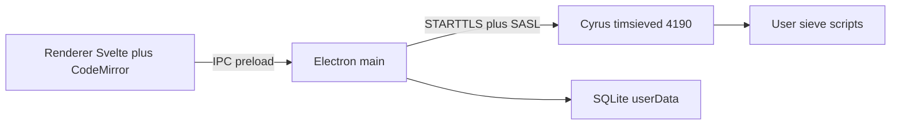

# Sieve

Desktop editor for **Cyrus Sieve** scripts on a ManageSieve-compatible server. The point is to list, edit, save, activate, and delete scripts against live ManageSieve — with syntax highlighting — without standing up a web server or copying the old AGPL app.

- Protocol: [RFC 5804](https://datatracker.ietf.org/doc/html/rfc5804) (ManageSieve)
- Language: [RFC 5228](https://datatracker.ietf.org/doc/html/rfc5228) (Sieve)
- Sibling tree `sieve-old` (thsmi/sieve) is a **protocol and UX reference only**. Do not copy that code.

This is **not** SvelteKit. Browsers cannot speak ManageSieve (raw TCP). Electron’s **main process** owns the socket.

## Architecture



| Piece | Where |
| --- | --- |
| Window, IPC, session | [`src/main/index.ts`](src/main/index.ts) |
| ManageSieve client | [`src/main/managesieve.ts`](src/main/managesieve.ts) |
| SQLite / accounts | [`src/main/db/`](src/main/db/) |
| Preload `contextBridge` | [`src/preload/index.ts`](src/preload/index.ts) |
| Login, list, editor | [`src/renderer/src/App.svelte`](src/renderer/src/App.svelte) |

Main uses `contextIsolation: true` and `nodeIntegration: false`. The renderer never gets `net` / `tls`. One TCP session per logged-in account. IPC: `list`, `get`, `put`, `activate`, `delete`, `check`.

Cyrus allows **one active script**. Syntax errors come back as `NO "line N: …"`. Script bodies use ManageSieve literals (`{n+}` / `{n}`).

## Cyrus / network

Host and port are editable in the login form (default port **4190**). Against Cyrus, that is `timsieved`.

On this mail host, `/etc/services` maps **`sieve` → 4190/tcp**, not 2000. `timsieved` listens on `0.0.0.0:4190`. Firewall `--dport sieve` therefore opens 4190. Two `cyrus.conf` lines (`listen="sieve"` and `listen="4190"`) are the **same port**. Default `nmap` without `-p` misses 4190 (not in the top 1000).

SASL: **PLAIN** and **LOGIN**. Always STARTTLS after the greeting when the server offers it. After TLS, the `STARTTLS` capability is gone; SASL stays PLAIN/LOGIN.

### TLS on the mail host (already hit this)

Certs live in `/var/imap/certs/`, not Apache’s tree (the `cyrus` user could not read `/etc/httpd/certs`):

```conf
tls_server_cert: /var/imap/certs/mail.fumlersoft.dk.crt
tls_server_key:  /var/imap/certs/mail.fumlersoft.dk.key
```

The key must be readable by group `cyrus` (`640 root:cyrus`). `STARTTLS` otherwise returns `NO "Error initializing TLS"`. Reload/restart Cyrus after path or mode changes (`prefork=1` keeps old children).

In Cyrus 3.8, **`tls_server_ca_file` is not the chain you present to clients**. It is CAs used when Cyrus acts as a *client*. Put the full chain in `tls_server_cert`.

The server cert is issued by private CA **Trader Internet Root CA**. Node’s Mozilla bundle fails (`UNABLE_TO_VERIFY_LEAF_SIGNATURE`). This Windows box trusts that root in the OS store; the app uses `tls.getCACertificates('system')`. Login can still allow plaintext or skip cert verify as a fallback.

## Local data

No MySQL. Drizzle ORM + **better-sqlite3** in main only.

- File: `sieve.sqlite` under Electron `app.getPath('userData')` (not in this repo)
- Tables: `accounts` (host, port, user, TLS prefs, last script — one row per server+user), `settings` (window bounds, last account, indent)
- Passwords: `safeStorage.encryptString` (Windows DPAPI), ciphertext in SQLite — never plaintext, never committed
- Migrations: [`drizzle/`](drizzle/) — applied on startup

Scripts stay on Cyrus. SQLite is not a backup of script bodies.

## Dev / package

Electron 43+ does **not** download its binary in npm `postinstall`. This repo’s `postinstall` runs `node ./node_modules/electron/install.js` then rebuilds native modules. If you see `Error: Electron uninstall`, the zip was not extracted — run that install script again.

```bash
cd sieve-editor
pnpm.cmd install
pnpm.cmd dev
```

Windows installer:

```bash
pnpm.cmd run build:win
```

Unpackaged dir only: `pnpm.cmd run build:unpack`. Linux locally: `pnpm.cmd run build:linux` (AppImage + .deb).

## Release

Ship from a **clean `develop`** that matches **`origin/develop`**:

```bash
cd sieve-editor
pnpm.cmd release
```

Optional version bump first (`package.json` is currently **0.1.0**):

```bash
pnpm.cmd release -- --bump patch
```

The script fails unless the current branch is `develop` and it is synced with GitHub. Then it opens a Release PR to `main`, merges it, tags `vX.Y.Z`, pushes the tag, and GitHub Actions builds unsigned binaries onto that GitHub Release:

| Platform | Installer | Portable |
| --- | --- | --- |
| Windows | NSIS `sieve-editor-*-setup.exe` | `sieve-editor-*-portable.exe` |
| Linux | `.deb` | AppImage |

Linux artifacts are built on Ubuntu runners; they are not tested on a local Linux desktop. macOS is not in this flow (no signing/notarization). `gh` must be logged in (`gh auth login -p ssh`).

UI notes:

- Script list: **include tree** from the active script (RFC 6609); unused scripts below
- CodeMirror 6 + `@codemirror/legacy-modes` sieve mode; keywords from CAPABILITY `SIEVE`
- Debounced server syntax check (~500ms): `CHECKSCRIPT` when advertised, otherwise PUTSCRIPT/DELETESCRIPT (RFC 5804 fallback). Local checks: unclosed strings, unmatched `[]` `()` `{}`, missing `,` in lists, missing `;` after commands.
- Multiple servers/accounts: saved list on connect; **Disconnect** returns there. Socket drop stays in the editor with **Connect**.
- Save limit **50K** (`sieve_maxscriptsize`)

## Out of scope

Graphical block editor, GSSAPI/Kerberos, a browser-facing HTTP proxy, copying sieve-old, macOS packages.

## Plans

Original implementation notes live in [`docs/plans/`](docs/plans/). Start with this README for how the app works now.
