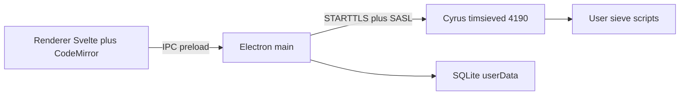

# Sieve editor for Cyrus (sieve-new) — Electron

Archived implementation plan. How the app works today: [README.md](../../README.md).

`sieve-old` is already an AGPL Electron app (CodeMirror 5 + full ManageSieve). Treat it as a **protocol and UX reference only** — do not copy that code. Specs: [RFC 5804](https://datatracker.ietf.org/doc/html/rfc5804) (ManageSieve) and [RFC 5228](https://datatracker.ietf.org/doc/html/rfc5228) (Sieve language).

Electron is a good fit: ManageSieve is raw TCP. The **main process** owns the socket. The renderer never gets `net`/`tls`. **mail.fumlersoft.dk:4190** is the live Cyrus ManageSieve endpoint.



This is **not** SvelteKit adapter-node. Use **Vite + Svelte** in the renderer (electron-vite or a small custom main/preload/renderer layout). IPC replaces form actions.

## 1. Cyrus / network

**Confirmed on mail.fumlersoft.dk:**

- `/etc/services`: `sieve` = **4190/tcp** (not 2000).
- `timsieved` listens on **0.0.0.0:4190** and `[::]:4190`.
- From this PC: `nmap -p 2000,4190 mail` → **4190 open**, 2000 filtered.
- Default `nmap mail` missed 4190 because it only scans the top 1000 ports.
- Firewall `--dport sieve` therefore **does** open 4190 on this host. Both `listen="sieve"` and `listen="4190"` in `cyrus.conf` are the same port (two master entries; one process family on 4190).

App defaults: host `mail.fumlersoft.dk`, port **4190**, still editable. STARTTLS after `CAPABILITY`. SASL PLAIN (or LOGIN) over TLS first.

## 1b. AUTH proof

From this PC, `mail.fumlersoft.dk:4190` **is** ManageSieve and the mailbox login works:

- Greeting: `Cyrus timsieved 3.8.0`, `VERSION 1.0`, `SASL` **PLAIN LOGIN**, `STARTTLS`, `UNAUTHENTICATE`.
- Cleartext **AUTHENTICATE PLAIN** as **`mogens@fumlersoft.dk`** → `OK` (earlier, while TLS was broken).
- `LISTSCRIPTS` → `OK`; **`default` is ACTIVE**.
- Password not stored in the repo.

v1 client: default host/port `mail.fumlersoft.dk:4190`, SASL PLAIN, **STARTTLS first**. Trust **Windows system CAs** (or ship/trust `Trader Internet Root CA`); Node’s default Mozilla bundle does **not** verify this cert. Keep a “allow unencrypted” escape only as fallback.

## 1c. timsieved TLS — fixed

After `/var/imap/certs/`, key `640 root:cyrus`, live paths:

```
tls_server_cert: /var/imap/certs/mail.fumlersoft.dk.crt
tls_server_key: /var/imap/certs/mail.fumlersoft.dk.key
tls_server_ca_file: /var/imap/certs/ca.crt
```

and Cyrus restart: **STARTTLS `OK "Begin TLS negotiation now"`**, TLSv1.3, post-TLS greeting `OK`, SASL still PLAIN LOGIN (STARTTLS cap dropped, as it should).

Cert is **private CA** `Trader Internet Root CA` → `mail.fumlersoft.dk` (valid to 2033). Node without `--use-system-ca`: `UNABLE_TO_VERIFY_LEAF_SIGNATURE`. Node `--use-system-ca` on this PC: **authorized**. Electron should use the OS trust store, not Node’s bundled CAs only.

## 2. ManageSieve client (Electron main)

Node `tls.connect` / `net` + STARTTLS in **main only**:

- Parse greetings and `OK` / `NO` / `BYE`.
- **Literals** for script bodies (`{n+}` / `{n}`).
- Commands: `CAPABILITY`, `STARTTLS`, `AUTHENTICATE`, `LISTSCRIPTS`, `GETSCRIPT`, `PUTSCRIPT`, `SETACTIVE` (empty name = deactivate), `DELETESCRIPT`, `CHECKSCRIPT` if advertised, `LOGOUT`.
- One TCP session per logged-in account; expose a narrow IPC API (`list`, `get`, `put`, `activate`, `delete`, `check`).

Cyrus: **one active script**; `NO "line N: …"` on syntax errors; max size from capabilities; CRLF.

**Security:** `contextIsolation: true`, `nodeIntegration: false`, preload `contextBridge` only.

## 3. Local data (SQLite, not MySQL)

No local MySQL. App state lives in a **SQLite file** under Electron `app.getPath('userData')` (not next to the repo, not in sieve-new).

- **Drizzle ORM** + **better-sqlite3** in **main only** (same stack family as videoscan, sqlite driver instead of mysql2). Native module: rebuild for Electron (`electron-builder` / `@electron/rebuild`).
- Schema-first + **checked-in drizzle-kit migrations**; run `migrate()` on startup.
- Tables (v1, keep small):
  - `accounts` — host, port, username, STARTTLS/require-TLS flag, last opened script name, last used timestamp
  - `settings` — window bounds, last account id (or a single row)
- **Passwords:** `safeStorage.encryptString` (OS DPAPI on Windows), store the ciphertext in SQLite or a sidecar file. Never plaintext SQL, never commit credentials.
- Scripts stay on Cyrus; SQLite is not a script backup unless you ask later.

## 4. Desktop UI + packaging

Renderer:

- Login (host/port/user/password).
- Script list (name, active).
- Editor; save / activate / delete.

Package with **electron-builder** (Windows nsis/portable first). sieve-old used `@electron/packager` + gulp; new app can stay simpler (electron-vite + electron-builder).

Skip for v1: graphical block editor, Thunderbird APIs, websocket proxy, GSSAPI, auto-update.

## 5. Editor + highlighting

- **CodeMirror 6** in Svelte.
- Language: `@codemirror/legacy-modes` **sieve** stream parser.
- Keywords from **CAPABILITY** `SIEVE` (`fileinto`, `vacation`, `mailbox`, …).
- Validation: debounced `CHECKSCRIPT` over IPC (fallback: temp `PUTSCRIPT` + delete). Line diagnostics in the gutter.

## 6. Ready to implement

Cyrus is unblocked: 4190, STARTTLS, PLAIN, list scripts. `imapd.conf` is gone from sieve-new.

- Optional (not blocking): AUTH + `LISTSCRIPTS` **after** STARTTLS (we proved each half separately).
- Greeting has **no `CHECKSCRIPT`** token — validate with `PUTSCRIPT` (or skip live validate until that exists).
- `sieve_maxscriptsize: 50K` — surface over-size on save.
- Electron TLS: OS trust store (`Trader Internet Root CA` is on this Windows box). Default Node CA bundle will fail.

## 7. Suggested build order

1. Electron + Vite + Svelte shell; IPC ping; SQLite/Drizzle in userData.
2. Main ManageSieve client; login + `LISTSCRIPTS`; persist account.
3. Get/put/activate/delete.
4. CodeMirror + CHECKSCRIPT.
5. Windows installer; TLS error UX; idle disconnect.

## Out of scope unless you ask

Graphical Sieve builder, multi-account polish like sieve-old, Kerberos, shipping a web server, Linux/mac packages (easy to add later).
